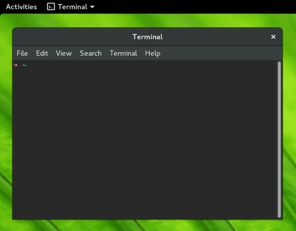

# .bash.d

My personal bash configuration files. Mostly revolving around `git` and `ruby`. Requires bash 4+.

## Features

* Displays current git branch, clean / dirty state within repositories
* Optionally, the ruby version, provided both a Gemfile and git repo are present
* If within a git repo the path relative to the git root, instead of the absolute path
* Truncates current working directory path, if it's larger than a certain percentage of the viewport



## Installation

```bash
git clone git://github.com/viseztrance/.bash.d.git ~/.bash.d && ~/.bash.d/install
```

## Extras

```bash
dnf install autojump
```

## License

This package is licensed under the MIT license and/or the Creative Commons Attribution-ShareAlike.
